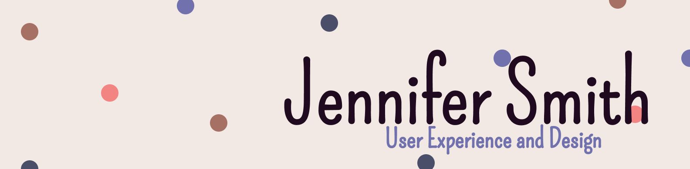

# 

## 

 

 🌱 <b>I’m currently learning:</b>  - JavaScript / React  
- UI / UX  

 

<b> 🤜🏽🤛🏽 I’m looking to collaborate on:</b>  - UI / UX projects 
  

<b> 🤳🏽 How to reach me: </b>  You can find me on  .
 

 

<!--
**JenniferSmith007/JenniferSmith007** is a ✨ _special_ ✨ repository because its `README.md` (this file) appears on your GitHub profile.

Here are some ideas to get you started:

- 🔭 I’m currently working on ...
- 🌱 I’m currently learning ...
- 👯 I’m looking to collaborate on ...
- 🤔 I’m looking for help with ...
- 💬 Ask me about ...
- 📫 How to reach me: ...
- 😄 Pronouns: ...
- ⚡ Fun fact: ...
  -->
