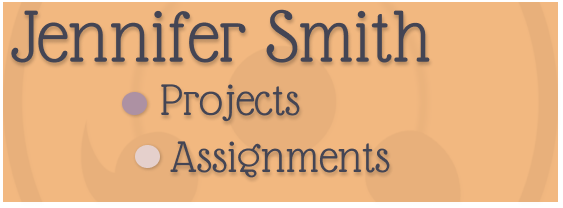

# 

🦋Welcome🦋 

  <h2>Learning all that I can to make it possible in obtaining a career in Front-End development.</h2>

- 🌱 I’m currently learning: **JavaScript**

- ⚡ Fun fact: **Enjoy creating CSS art whenever I have free time.**

"If you get up in the morning and think the future is going to be better, it is a bright day. Otherwise, it's not."- **Elon Musk**

<!--
**JenniferSmith007/JenniferSmith007** is a ✨ _special_ ✨ repository because its `README.md` (this file) appears on your GitHub profile.

Here are some ideas to get you started:

- 🔭 I’m currently working on ...
- 🌱 I’m currently learning ...
- 👯 I’m looking to collaborate on ...
- 🤔 I’m looking for help with ...
- 💬 Ask me about ...
- 📫 How to reach me: ...
- 😄 Pronouns: ...
- ⚡ Fun fact: ...
-->
